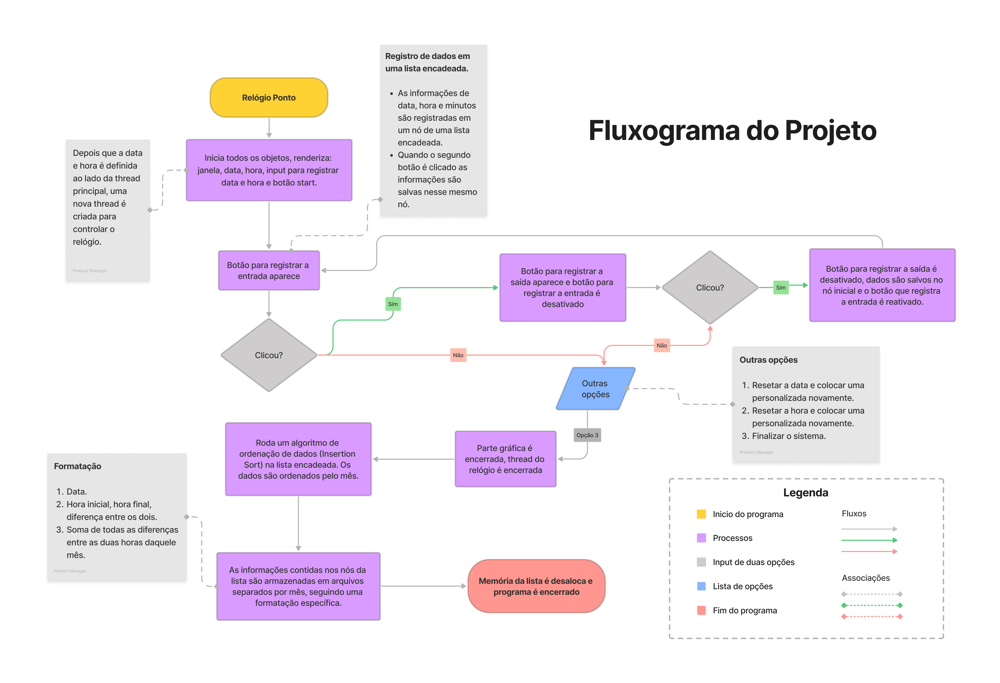

<h1 align="center">Relógio Ponto</h1>

  

    <strong>Relógio básico com interface gráfica utilizado para registrar horas trabalhadas.</strong>
  

  

    
    
  

## Descrição
Projeto executado em C++, orientado a objetos, utilizando da biblioteca SFML para fazer os elementos gráficos. A lógica do relógio é baseada em um loop que possuí algumas verificações e a cada iteração ocorrida a thread é pausada por 1000ms.

## Fluxograma
⚠️ - Dependendo das dimensões do seu monitor, talvez seja necessário dar um zoom na janela para melhor visualização.

    

## Bibliotecas Usadas
Abaixo está uma lista das bibliotecas utilizadas no projeto:

- SFML(Window e Graphics),  
- Thread.h,  
- String.h,  
- iostream  

## Autores

| [ @reismatias](https://github.com/reismatias)  |
| :---: |
